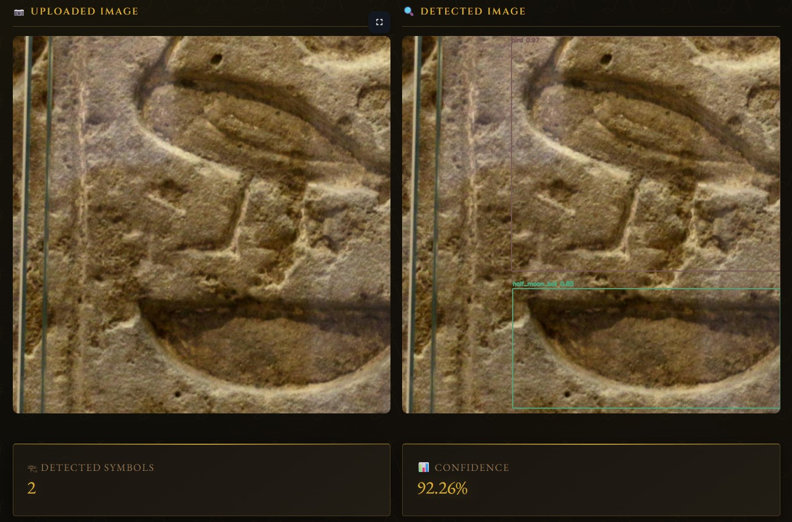

# 𓂀 Egyptian Symbol Interpreter

**AI-based Symbolic Interpretation Of Ancient Egyptian Paintings.**

A Streamlit web application combining YOLOv8 deep learning with an Egyptological knowledge base to detect, analyze, and interpret Egyptian hieroglyphic symbols in images with archaeological context.

---
## 🚀 Demo



## ✨ Features

### 🖼️ Image Analysis
- Upload paintings to detect Egyptian symbols
- Per-symbol confidence scores and bounding boxes
- Symbol frequency visualization
- Automatic annotated image generation
- CSV and PDF export options

### 📷 Live Camera Capture
- Real-time webcam symbol detection
- Frame-by-frame analysis with session memory
- Batch interpretation of multiple captures
- Symbol accumulation across captures

### 📊 Analytics Dashboard
- Historical detection insights
- Top symbols by frequency
- Average confidence tracking
- 7-day detection timeline
- Symbol distribution charts

### 📖 Symbol Dictionary
- Searchable database of 114+ Egyptian symbols
- Egyptological meanings and cultural significance
- Quick lookup and symbol details

### 💾 History & Persistence
- Automatic detection record storage (MongoDB)
- Per-record PDF report generation
- Delete and manage past analyses
- Timestamped records with IST timezone support

---

## 🚀 Quick Start

### Prerequisites
- **Python 3.9+**
- **Webcam/Camera** (for live capture feature)
- **MongoDB** (optional; for history persistence)
- **8GB RAM** minimum recommended
- **500MB free disk space**

### Installation

1. **Clone the repository:**
   ```bash
   git clone <repository-url>
   cd SymbolicInterpretationOfAncientEgyptPaintings
   ```

2. **Create virtual environment:**
   ```bash
   python -m venv venv
   ```

3. **Activate virtual environment:**
   ```bash
   # Windows
   venv\Scripts\activate
   # Linux/macOS
   source venv/bin/activate
   ```

4. **Install dependencies:**
   ```bash
   pip install -r requirements.txt
   ```

5. **Download YOLO model:**
   - Place `best.pt` in the `Weights/` folder
   - Or update the model path in the sidebar

### Run the App

```bash
streamlit run streamlitapp.py
```

The app will open at `http://localhost:8501` in your browser.

---

## 📖 Usage

### Analyzing an Image

1. **Navigate to "🖼 Image Analysis"** from the navigationbar
2. **Upload a painting** (JPG, PNG, BMP, WEBP supported)
3. **Adjust detection settings** (optional):
   - Confidence threshold
   - IoU threshold
   - Maximum symbols to detect
4. **Click "Analyze"** to run detection
5. **View results**:
   - Original and annotated images
   - Detection metrics (count, confidence, fusion match)
   - Symbol table with meanings
   - Frequency and confidence charts
6. **Export**:
   - Download text report
   - Download annotated image (PNG)
   - Download symbol CSV

### Live Camera Capture

1. **Navigate to "📷 Live Camera"** from the sidebar
2. **Click "Take Photo"** to capture a frame
3. **Click "Analyze"** to detect symbols in that frame
4. **View detection results** and symbol list
5. **Click "🔱 Interpret this capture"** for full interpretation
6. **Track session**:
   - See accumulated detections across frames
   - Click "🔱 Interpret session"** for batch interpretation
   - Click "🗑 Clear session"** to reset

### Viewing History

1. **Navigate to "📊 History"** from the sidebar
2. **Select a record** from the list
3. **View images and interpretation**
4. **Download PDF report** for that analysis
5. **Delete record** if needed (removes images from disk)

### Dashboard Insights

1. **Navigate to "📊 Dashboard"** from the sidebar
2. **View metrics**:
   - Total records analyzed
   - Average confidence across all records
   - Most frequently detected symbol
3. **See charts**:
   - Top 8 symbols by frequency
   - 7-day detection trend

### Symbol Dictionary

1. **Navigate to "📖 Symbol Dictionary"** from the sidebar
2. **Type symbol name** (e.g., "ank", "eye", "beetle")
3. **View canonical name and meaning**
4. Browse all 114+ symbols alphabetically

---

## 📍 Sidebar Guide

The **left sidebar** contains all navigation and configuration controls:

### Theme Toggle
- **☀️ / 🌙 Icon** (top-left corner)
- Toggle between **Dark Mode** and **Light Mode**
- Persists across sessions

### Navigation Tabs
The main navigation bar at the top shows:
- **Home** – Overview and getting started
- **🖼️ Analyze** – Image upload and detection
- **📷 Live Camera** – Webcam capture and frame-by-frame analysis
- **📊 Dashboard** – Metrics and trends
- **📖 Symbol Dictionary** – Symbol lookup
- **📚 History** – Past detections and records
- **ℹ️ About** – Project information

### Detection Settings Panel
Customize detection parameters (all persist during session):

| Control | Range | Default | Effect |
|---------|-------|---------|--------|
| **Confidence Threshold** | 0.10 – 0.95 | 0.65 | Only detections above this confidence are included |
| **IoU Threshold** | 0.10 – 0.95 | 0.60 | Overlap tolerance for merging overlapping boxes |
| **Max Symbols** | 1 – 30 | 10 | Maximum symbols to interpret per analysis |
| **Show Labels** | ✓ / ✗ | ON | Display symbol names on bounding boxes |

**💡 Pro Tips:**
- **Lower confidence** (0.40–0.50) for challenging/blurry images
- **Raise confidence** (0.75–0.85) for very clean, controlled images
- **Increase max symbols** if you want broader context (slower)
- **Decrease max symbols** for faster analysis of dominant symbols only

---

## ⚙️ Configuration

### Environment Variables

```bash
# MongoDB connection (optional)
export MONGO_URI=mongodb://localhost:27017/

# Database configuration (hardcoded)
# DB_NAME = egyptian_symbol_system
# COLLECTION = detections
```

### Model Configuration

- **Model path**: `Weights/best.pt` (or customize in settings)
- **YOLO version**: YOLOv8
- **Classes**: 114 Egyptian symbol categories
- **Input size**: 640×640 (auto-scaled)

---

## 🏗️ Project Structure

```
SymbolicInterpretationOfAncientEgyptPaintings/
│
├── streamlitapp.py              # Main Streamlit application ⭐
├── app.py                       # Flask backend (alternative)
├── streamlitappfinal.py         # Extended Streamlit variant
├── requirements.txt             # Python dependencies
├── README.md                    # This file
│
├── symbolic_interpreter.py      # Symbol interpretation pipeline
├── knowledge_base.py            # Symbol meanings & normalization
├── fusion_rules.py              # Multi-symbol interpretation rules
│
├── modules/
│   ├── __init__.py
│   └── detector.py              # YOLO detection wrapper
│
├── Weights/
│   ├── best.pt                  # Production YOLO model
│   ├── best1.pt                 # Alternative models
│   └── best2.pt
│
├── static/
│   ├── uploads/                 # Uploaded images
│   ├── detections/              # Annotated output images
│   ├── css/style.css
│   └── js/camera.js, theme.js
│
├── templates/                   # Flask HTML templates
│   ├── home.html
│   ├── analyze.html
│   ├── dashboard.html
│   ├── history.html
│   └── ...
│
├── datasetinfo/
│   ├── best.pt                  # Training model reference
│   ├── last.pt
│   └── results.csv
│
└── Media/                       # Demo images (optional)
```

---

## 🔧 Core Components

### `streamlitapp.py` (Main App)
**UI layer** – Streamlit interface with tabs for analysis, capture, history, and dashboard.

**Key features:**
- Multi-page Streamlit layout (sidebar navigation)
- Styled with custom CSS (luxury Egyptian theme)
- Session state management for camera persistence
- MongoDB integration for history
- Dynamic charts (Plotly)

### `symbolic_interpreter.py`
**Interpretation pipeline** – 7-step conversion from raw detections to narratives.

**Steps:**
1. Normalize symbol names (variant → canonical)
2. Remove duplicates & count occurrences
3. Rank by confidence
4. Extract meanings from knowledge base
5. Apply multi-symbol fusion rules
6. Compute final confidence
7. Generate natural-language interpretation

### `modules/detector.py`
**Detection wrapper** – YOLO inference and annotation.

**Functions:**
- `detect_symbols()` – Run detection on image file
- `draw_detections_on_frame()` – Annotate live camera frame
- Stable per-symbol color assignment

### `knowledge_base.py`
**Symbol database** – Meanings and variant normalization.

**Contents:**
- `SYMBOL_NORMALIZATION` – 25+ variant mappings
- `SYMBOL_MEANINGS` – 114+ symbol definitions
- `get_symbol_meaning()` – Lookup helper

### `fusion_rules.py`
**Multi-symbol patterns** – Predefined combinations with cultural meanings.

**Example:**
- "ankh + eye" → "The combination suggests divine protection and wholeness"
- Enables coherent multi-symbol interpretations

---

## 📊 Data Flow

```
┌─────────────────────┐
│  User Input         │
│ • Upload Image      │
│ • Live Capture      │
└──────────┬──────────┘
           ↓
┌─────────────────────────────────────┐
│  YOLO Detection (detector.py)        │
│ • Inference at conf_threshold        │
│ • NMS at iou_threshold               │
│ • Returns boxes, symbols, confidence │
└──────────┬──────────────────────────┘
           ↓
┌──────────────────────────────────────────────┐
│  Symbolic Interpreter Pipeline               │
│ 1. Normalize symbols                         │
│ 2. Deduplicate & count                       │
│ 3. Rank by confidence                        │
│ 4. Extract meanings (knowledge_base.py)      │
│ 5. Apply fusion rules (fusion_rules.py)      │
│ 6. Compute confidence score                  │
│ 7. Generate narrative                        │
└──────────┬───────────────────────────────────┘
           ↓
┌──────────────────────────────────────┐
│  Report Generation                   │
│ • Symbols & confidence               │
│ • Fusion interpretation              │
│ • Final paragraph                    │
│ • Charts & metrics                   │
└──────────┬───────────────────────────┘
           ↓
┌──────────────────────────────────────┐
│  Output & Storage                    │
│ • Display in UI                      │
│ • MongoDB record (optional)          │
│ • PDF export                         │
└──────────────────────────────────────┘
```

---

## 🗄️ MongoDB Storage

### Collection Schema

```json
{
  "timestamp": "2026-05-01T14:30:22.123456Z",
  "filename": "painting_scan.jpg",
  "mode": "image_upload",
  "detections": [
    {
      "symbol": "ank",
      "confidence": 0.92,
      "count": 2
    },
    {
      "symbol": "eye",
      "confidence": 0.89,
      "count": 1
    }
  ],
  "total_detections": 8,
  "unique_symbols": 5,
  "confidence_score": 0.82,
  "fusion_matched": true,
  "fusion_symbols": ["ank", "eye"],
  "fusion_text": "The combination suggests divine protection...",
  "final_paragraph": "This painting most prominently features..."
}
```

### MongoDB Setup

```bash
# Local MongoDB (via Docker)
docker run -d -p 27017:27017 --name mongo mongo:latest

# Or install MongoDB locally
# https://docs.mongodb.com/manual/installation/

# Set connection URI (if not localhost:27017)
export MONGO_URI=mongodb://your-host:27017/
```

---

## 📦 Dependencies

| Library | Purpose |
|---------|---------|
| `streamlit` | Web UI framework |
| `ultralytics` | YOLOv8 detection model |
| `opencv-python` | Image processing & camera |
| `pymongo` | MongoDB client |
| `plotly` | Interactive charts |
| `pandas` | Data manipulation |
| `reportlab` | PDF generation |
| `pillow` | Image I/O |
| `numpy` | Numerical computing |

Install all: `pip install -r requirements.txt`

---

## 🐛 Troubleshooting

### Streamlit ScriptRunContext Warning
**Error**: `scriptruntext undefined`

**Solution**: Run with `-m streamlit`:
```bash
python -m streamlit run streamlitapp.py
```

### Camera Not Working
**Symptom**: Camera input widget is blank or unresponsive

**Windows**: Update DirectShow drivers for your camera
**Linux**: Verify V4L2 device: `ls /dev/video*`
**macOS**: Grant camera permissions in System Preferences

### Model Not Found
**Error**: `Model not found at 'Weights/best.pt'`

**Solution**:
1. Download/place `best.pt` in `Weights/` folder
2. Or update path in sidebar: "Model path"

### Low Detection Confidence
**Symptom**: Few or no detections

**Solution**:
- Lower confidence threshold in sidebar (try 0.40)
- Use clearer images with good lighting
- Ensure symbols are clearly visible
- Check image resolution (640×640 minimum recommended)

### MongoDB Connection Failed
**Error**: `serverSelectionTimeoutMS exceeded`

**Solution**:
- Verify MongoDB is running: `mongod`
- Check `MONGO_URI` environment variable
- App still works offline; history just won't persist

### Streamlit Not Found
**Error**: `No module named streamlit`

**Solution**:
```bash
pip install -r requirements.txt
# or
pip install streamlit
```

---

## 🎓 How It Works

### Symbol Detection
1. **Input image** is preprocessed to 640×640
2. **YOLO model** (114 class detector) runs inference
3. **Bounding boxes** with class labels and confidence scores returned
4. **Non-maximum suppression** removes overlapping detections
5. **Detections** sorted by confidence; top-N retained

### Interpretation
1. **Symbols normalized** (e.g., "ankh" → "ank")
2. **Duplicates collapsed** with count tracking
3. **Meanings retrieved** from knowledge base (114+ definitions)
4. **Fusion rules applied** to detect multi-symbol patterns
5. **Confidence computed** as weighted combination of scores
6. **Narrative generated** based on detected symbols and fusion match

### Persistence
- **Auto-saved** to MongoDB on each analysis
- **Retrievable** via history page
- **Exportable** as PDF (includes images and interpretation)

---

## 📝 Examples

### Example: Ankh + Eye Analysis

**Input**: Painting with visible ankh and eye symbols

**Detection Output**:
```
Symbols Detected: ankh, eye
Confidence: 89%
Fusion Match: Yes (ankh + eye)
```

**Interpretation**:
> "This painting most prominently features the ankh (symbol of life and eternal existence). The combination of ankh and eye suggests that the scene depicts divine protection and restored wholeness. The visual evidence is read with high confidence (89%), indicating that this interpretation is well-supported by the detected symbolic content."

**Exports**:
- PDF report with images and analysis
- CSV with symbol metadata
- Text interpretation file

---

## 🤝 Contributing

Contributions welcome! Areas for enhancement:
- Additional symbol classes or fusion rules
- Multi-language support for symbol meanings
- Batch processing for bulk image analysis
- Performance optimizations (batching, caching)
- Mobile app wrapper

---

## 📄 License

This project is licensed under the MIT License.

---

## 👥 Authors & Credits

- **Project**: AI-Based Symbolic Interpretation of Ancient Egyptian Paintings
- **Timeline**: March – May 2026
- **Built with**: YOLOv8, Streamlit, MongoDB, ReportLab

### References
- [Ultralytics YOLOv8](https://github.com/ultralytics/ultralytics)
- [Streamlit Documentation](https://docs.streamlit.io)
- [MongoDB Python Driver](https://pymongo.readthedocs.io)
- Egyptian Hieroglyphic Symbol Database: [Your Sources]

---

## 📞 Support

For issues, questions, or feature requests:
1. Check the **Troubleshooting** section above
2. Open an issue on GitHub

---

**Last Updated**: May 1, 2026  
**Status**: Active Development
